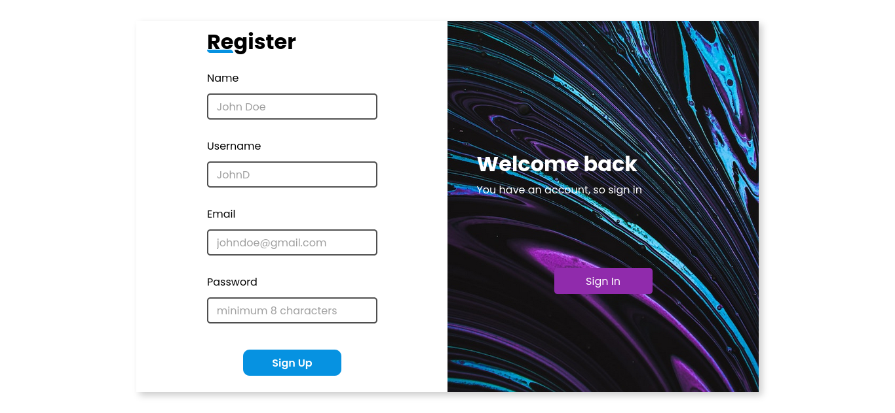
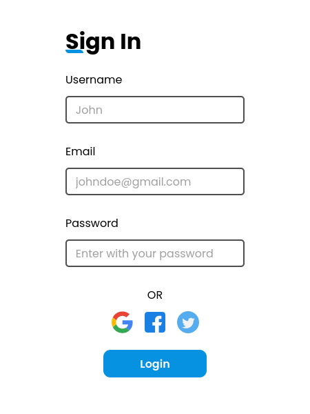

# Formulários

## :computer: Sobre este repositório
------
O objetivo deste repositório é conter diversos formulários feitos com tecnologias variadas, como html, css, sass, js,  tailwindcss, react, typescript, vue.js....

> git clone https://github.com/RiuriII/forms.git  

&nbsp; 

# :triangular_flag_on_post:Form  #1

Formulário de login e registro, utilizando:
&nbsp; 
 
 HTML - Para estrutura

 
 SCSS - Para estilização

 
 JavaScript - Para a validação dos formulários

&nbsp; 
## :art: Layout

### Mobile layout

&nbsp; 

## 📃 Licença

